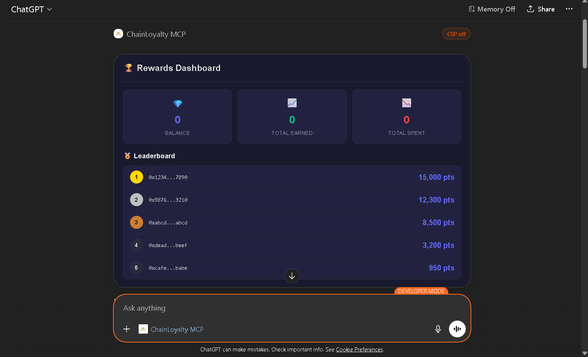
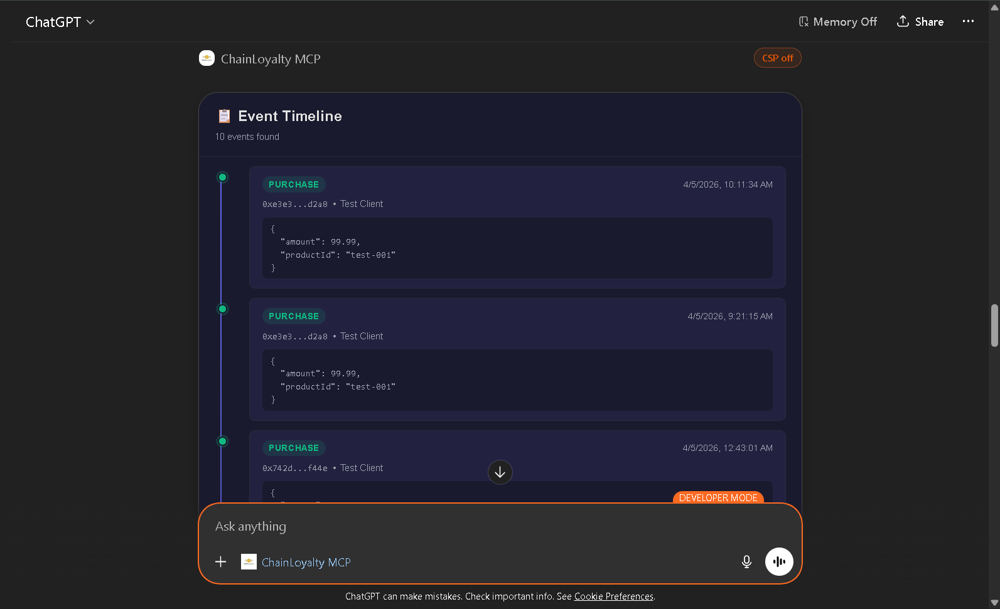
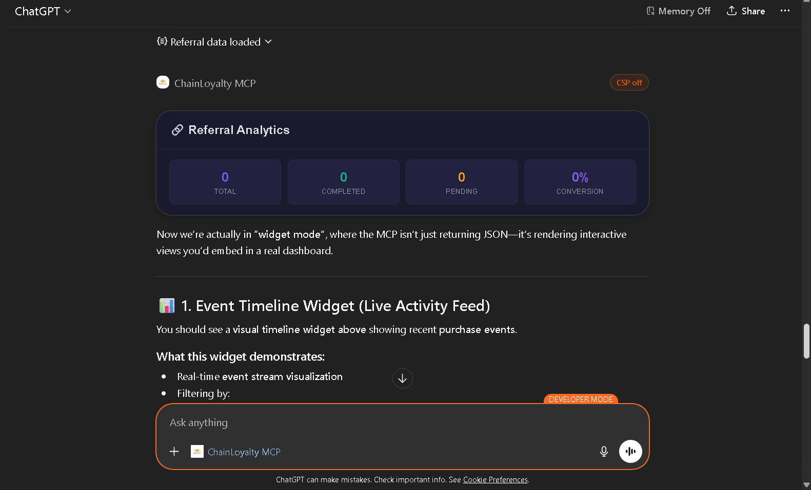
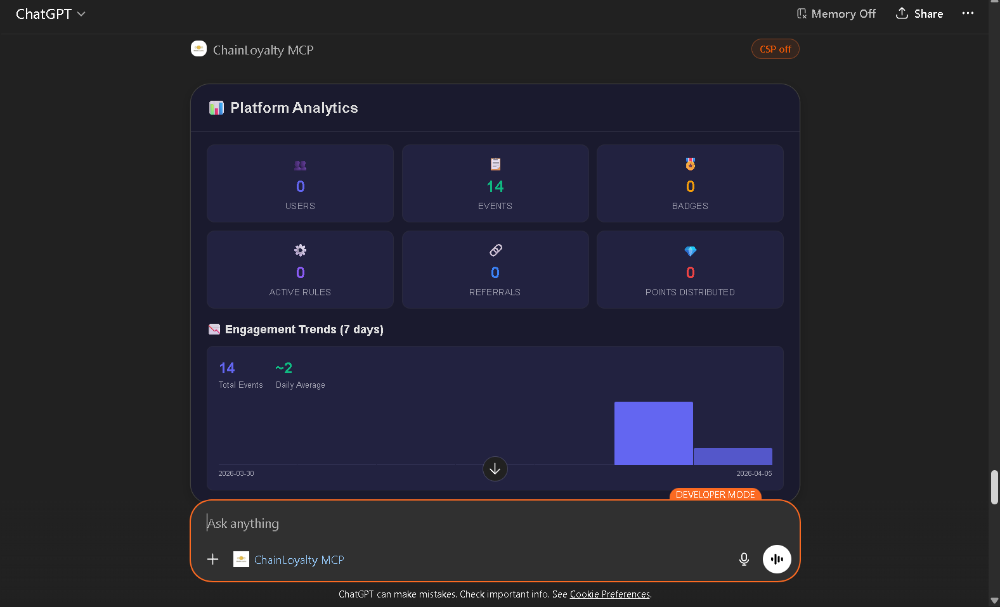
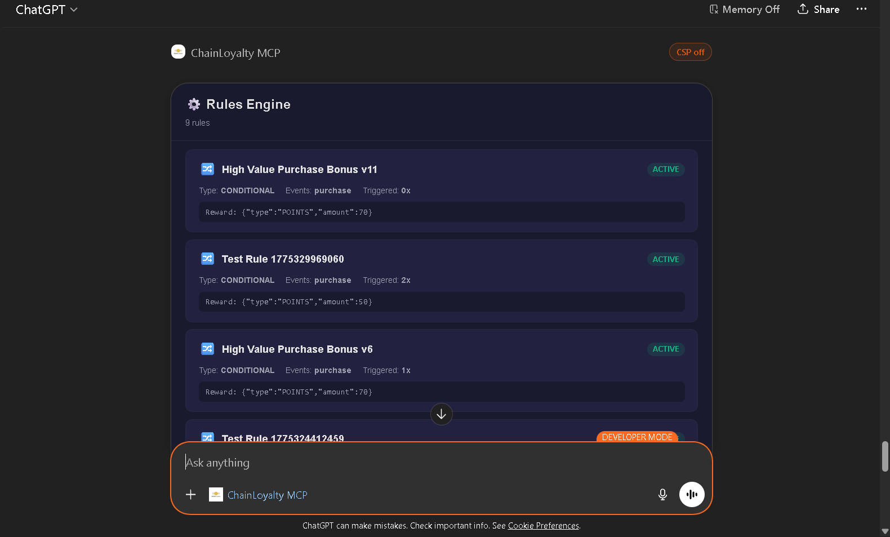
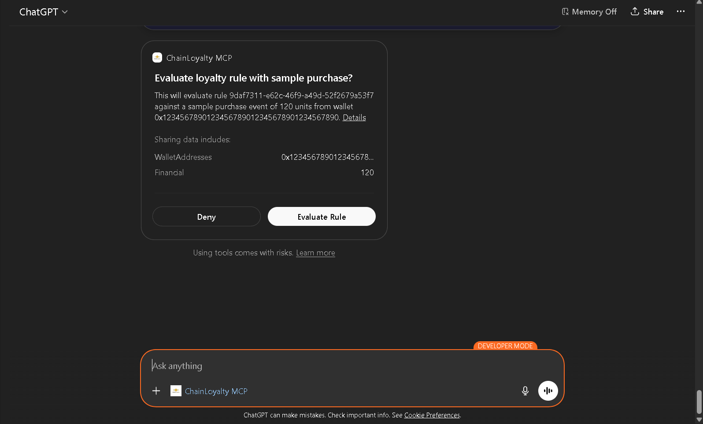
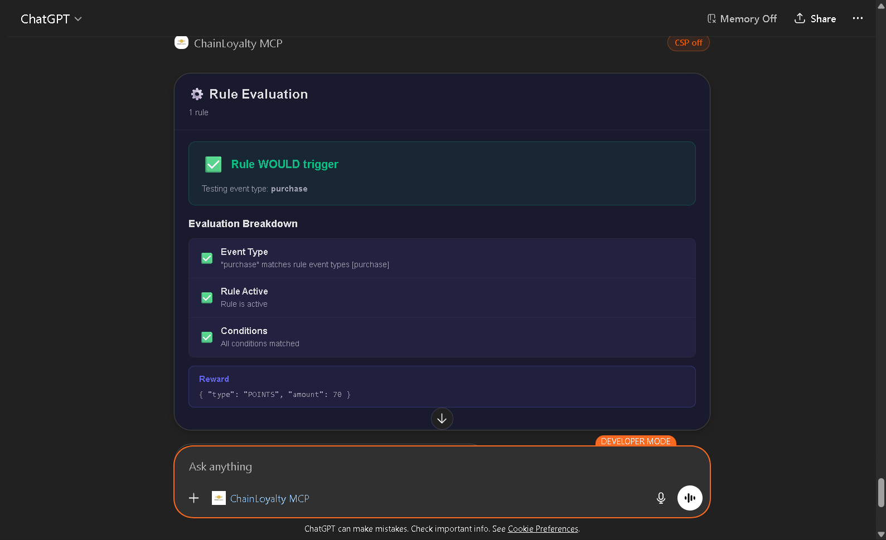

# ChainLoyalty Intelligence Platform — MCP Server

[](https://round-frog-gb3og.run.mcp-use.com/mcp)
[](https://opensource.org/licenses/MIT)
[](https://chat.openai.com/)
[](https://www.npmjs.com/package/@t0x1n/chainloyalty-mcp-server)

AI-powered loyalty platform management server built with **mcp-use**. Query events, analyze rewards, debug rules, track referrals, and monitor platform analytics with interactive widgets.

## Quick Start

### Option 1: Install from NPM (Recommended)

```bash
# 1. Install the package
npm install @t0x1n/chainloyalty-mcp-server

# 2. Set up environment
cp node_modules/@t0x1n/chainloyalty-mcp-server/.env.example .env
# Edit .env with your DATABASE_URL

# 3. Run the server
npx @t0x1n/chainloyalty-mcp-server
```

### Option 2: Clone and Run Locally

```bash
# 1. Clone the repository
git clone https://github.com/N1KH1LT0X1N/ChainLoyalty-MCP.git
cd ChainLoyalty-MCP

# 2. Install dependencies
npm install --ignore-scripts --force

# 3. Generate Prisma client
npx prisma generate

# 4. Set up environment
cp .env.example .env
# Edit .env with your DATABASE_URL

# 5. Run dev server
npx mcp-use dev
```

Inspector: [http://localhost:3000/inspector](http://localhost:3000/inspector)

## Environment Variables

| Variable | Required | Description |
|----------|----------|-------------|
| `DATABASE_URL` | ✅ | PostgreSQL connection string (Neon) |
| `MCP_URL` | ❌ | Server base URL (default: `http://localhost:3000`) |
| `NODE_ENV` | ❌ | Environment (default: `development`) |

## Tools (18 total)

### Events (3 tools)
| Tool | Description | Widget |
|------|-------------|--------|
| `query-events` | Search events by wallet/type/date | event-timeline |
| `get-event-types` | List event types with counts | — |
| `count-events` | Aggregate event counts | — |

### Rewards (3 tools)
| Tool | Description | Widget |
|------|-------------|--------|
| `get-rewards` | Full rewards overview for a wallet | rewards-dashboard |
| `get-leaderboard` | Top users by points | rewards-dashboard |
| `get-badge-owners` | Users who own a specific badge | — |

### Rules (3 tools)
| Tool | Description | Widget |
|------|-------------|--------|
| `list-rules` | Show all loyalty rules | rule-debugger |
| `evaluate-rule` | Test rule against sample event | rule-debugger |
| `get-rule-details` | Detailed rule info with triggers | — |

### Referrals (3 tools)
| Tool | Description | Widget |
|------|-------------|--------|
| `get-referral-stats` | Referral stats for a wallet | referral-analytics |
| `lookup-code` | Check referral code validity | — |
| `get-top-referrers` | Top referrers leaderboard | referral-analytics |

### Wallet (3 tools)
| Tool | Description | Widget |
|------|-------------|--------|
| `check-wallet` | Wallet existence & summary | — |
| `get-wallet-activity` | Recent activity timeline | wallet-overview |
| `wallet-summary` | Comprehensive wallet overview | wallet-overview |

### Analytics (3 tools)
| Tool | Description | Widget |
|------|-------------|--------|
| `platform-stats` | Overall platform metrics | analytics-dashboard |
| `active-users` | Active user counts by period | — |
| `engagement-trends` | Engagement over time | analytics-dashboard |

## Widgets (6)

1. **event-timeline** — Chronological event display with color-coded badges
2. **rewards-dashboard** — Points cards, badge grid, transactions, leaderboard
3. **rule-debugger** — Rule list & evaluation breakdown with pass/fail indicators
4. **referral-analytics** — Referral stats, codes, conversion funnel, top referrers
5. **wallet-overview** — Complete wallet profile with points, badges, events
6. **analytics-dashboard** — KPI cards, event distribution bars, engagement trends chart

## Project Structure

```
packages/ChainLoyalty/
├── index.ts                      # Server entry — registers all tools
├── src/
│   ├── tools/
│   │   ├── events.ts             # Event query tools
│   │   ├── rewards.ts            # Rewards & leaderboard tools
│   │   ├── rules.ts              # Rules engine & debugger tools
│   │   ├── referrals.ts          # Referral tracking tools
│   │   ├── wallet.ts             # Wallet inspection tools
│   │   └── analytics.ts          # Platform analytics tools
│   └── utils/
│       ├── prisma.ts             # Prisma client singleton
│       ├── validators.ts         # Input validation helpers
│       └── formatters.ts         # Output formatting helpers
├── resources/
│   ├── event-timeline.tsx        # Event timeline widget
│   ├── rewards-dashboard.tsx     # Rewards dashboard widget
│   ├── rule-debugger.tsx         # Rule debugger widget
│   ├── referral-analytics.tsx    # Referral analytics widget
│   ├── wallet-overview.tsx       # Wallet overview widget
│   ├── analytics-dashboard.tsx   # Analytics dashboard widget
│   └── styles.css                # Global widget styles
├── prisma/
│   └── schema.prisma             # Database schema (10 tables)
├── .env                          # Environment variables
└── package.json                  # Dependencies
```

## Deployment

### Manufact Cloud
```bash
npm run deploy
```

### ChatGPT Integration
1. Deploy to Manufact Cloud ✅ *(Already deployed)*
2. Open ChatGPT Settings → Beta Features
3. Enable "ChatGPT Apps" / "MCP Integration"
4. Add server URL: `https://round-frog-gb3og.run.mcp-use.com/mcp`
5. Start managing your loyalty platform with AI! 🚀

### Try It Now

🟢 **Live Instance**: [https://round-frog-gb3og.run.mcp-use.com/mcp](https://round-frog-gb3og.run.mcp-use.com/mcp)

#### Example Prompts to Try:
- "Show me the top 10 users by points"
- "What are the recent events for wallet 0x1234...?"
- "Debug why my referral rule isn't working"
- "Show me the platform analytics dashboard"
- "Check if referral code SAVE20 is valid"
- "Display the rewards overview for user 0xabcd..."

## 📸 Screenshots & Demos

### ChatGPT App Integration

*Interactive widgets in ChatGPT showing platform analytics*

### Interactive Widgets

#### Analytics Dashboard

**Analytics Dashboard** - Real-time platform metrics with engagement charts and event distribution

#### Rewards Dashboard  

**Rewards Dashboard** - Points tracking, badge collection, and leaderboards

#### Rule Debugger

**Rule Debugger** - Test and debug loyalty rules with detailed evaluation breakdowns

#### Event Timeline

**Event Timeline** - Chronological event display with color-coded badges

#### Referral Analytics

**Referral Analytics** - Track referral performance, conversion funnels, and top referrers

#### Wallet Overview

**Wallet Overview** - Complete user profile with points balance, badges, and recent activity

### Video Demo
[](https://drive.google.com/file/d/YOUR_VIDEO_ID/view?usp=sharing)
*Watch a 2-minute walkthrough of the ChainLoyalty MCP Server*

> 💡 **Demo Video**: [Google Drive Link](https://drive.google.com/file/d/YOUR_VIDEO_ID/view?usp=sharing) - Replace with your actual video link

## Database

Uses PostgreSQL (Neon) with Prisma ORM. 10 tables:
- `Client`, `Event`, `PointsBalance`, `PointsTransaction`
- `Badge`, `BadgeOwnership`
- `Rule`, `RewardLog`
- `ReferralCode`, `Referral`, `WalletSession`

## 🧪 Testing & Demo Data

### Sample Data for Testing

The server includes sample data for testing. Here are some example wallet addresses you can use:

- `0x742d35Cc6634C0532925a3b8D4C9db96C4b4Db45` - Power user with 10,000+ points
- `0x8ba1f109551bD432803012645Hac136c22C57B` - Regular user with active referrals
- `0x1234567890123456789012345678901234567890` - New user with minimal activity

### Testing Scenarios

Try these test scenarios to explore all features:

1. **Events Query**
   ```
   Query events for wallet 0x742d35Cc6634C0532925a3b8D4C9db96C4b4Db45
   Filter by event type: "reward_earned"
   Date range: Last 30 days
   ```

2. **Rules Debugging**
   ```
   Test rule: "Weekly Bonus Rule"
   Sample event: {"type": "purchase", "amount": 100, "wallet": "0x742d..."}
   Check if rule triggers correctly
   ```

3. **Referral Analytics**
   ```
   Check referral code: "WELCOME10"
   View referral stats for wallet 0x8ba1f...
   Show top 5 referrers
   ```

4. **Platform Analytics**
   ```
   Show overall platform stats
   Active users: Last 7 days
   Engagement trends: Last 30 days
   ```

### Test Scripts

We provide test scripts in the `/tests` directory:

```bash
# Run all tests
npm test

# Run specific tool tests
npm test -- events
npm test -- rewards
npm test -- rules

# Run with sample data
npm run test:sample
```

### Local Testing with Docker

```bash
# Spin up a test database
docker-compose up -d test-db

# Run migrations
npx prisma migrate deploy

# Seed test data
npm run seed:test

# Start testing
npm run test:local
```

## 🔧 Troubleshooting

### Common Issues

1. **Database Connection Failed**
   - Verify DATABASE_URL is correct
   - Ensure SSL is enabled for Neon
   - Check network connectivity

2. **Prisma Client Not Generated**
   ```bash
   npx prisma generate
   ```

3. **Widgets Not Loading**
   - Check browser console for errors
   - Ensure React dependencies are installed
   - Verify widget exports in index.ts

4. **ChatGPT Integration Issues**
   - Confirm deployment URL is accessible
   - Check CORS settings
   - Verify MCP server is running

### Debug Mode

Enable debug logging:
```bash
DEBUG=mcp-use:* npx mcp-use dev
```

### Getting Help

- Check [Issues](https://github.com/N1KH1LT0X1N/ChainLoyalty-MCP/issues)
- Start a [Discussion](https://github.com/N1KH1LT0X1N/ChainLoyalty-MCP/discussions)
- Review [Documentation](https://github.com/N1KH1LT0X1N/ChainLoyalty-MCP#readme)

## 🌟 Community

- **Discord**: [Join our Discord](https://discord.gg/chainloyalty)
- **Twitter**: [@ChainLoyalty](https://twitter.com/chainloyalty)
- **Blog**: [chainloyalty.com/blog](https://chainloyalty.com/blog)

## 🤝 Contributing

We welcome contributions! Please see our [Contributing Guide](CONTRIBUTING.md) for details.

### Contributors

<a href="https://github.com/N1KH1LT0X1N/ChainLoyalty-MCP/graphs/contributors">
  
</a>

## 📄 License

This project is licensed under the MIT License - see the [LICENSE](LICENSE) file for details.

## 🙏 Acknowledgments

- [mcp-use](https://mcp-use.com) for the amazing MCP framework
- [OpenAI](https://openai.com) for ChatGPT Apps SDK
- [Prisma](https://prisma.io) for the excellent ORM
- [Tailwind CSS](https://tailwindcss.com) for the utility-first CSS framework
- All our [contributors](https://github.com/N1KH1LT0X1N/ChainLoyalty-MCP/graphs/contributors) who make this project better

---

<div align="center">
  <p>Made with ❤️ by the ChainLoyalty team</p>
  <p>
    <a href="#top">Back to top</a>
  </p>
</div>
